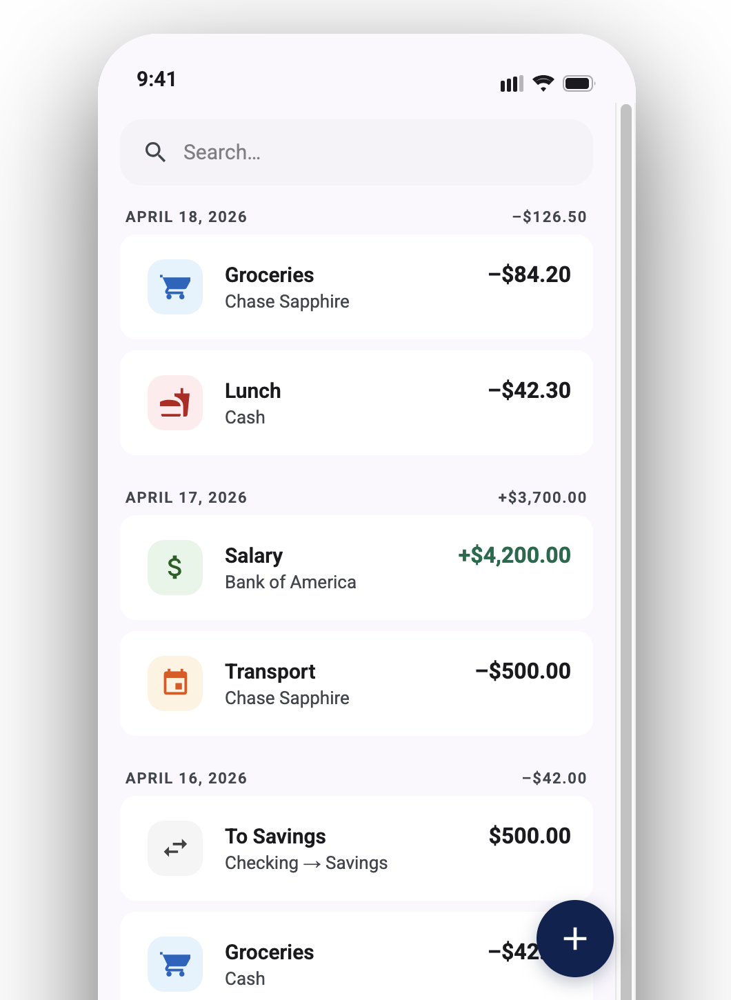
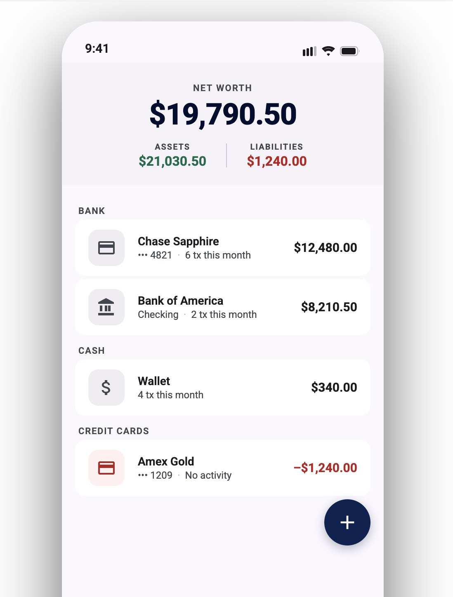

<h1 align="center">Zero</h1>

<p align="center"><em>A personal finance Android app — multi-currency, local-first, fast.</em></p>

<p align="center">
  
  
</p>

<p align="center">
  <a href="#what-it-does">What it does</a> ·
  <a href="#under-the-hood">Under the hood</a> ·
  <a href="#run-it">Run it</a> ·
  <a href="#how-features-ship">How features ship</a>
</p>

---

## What it does

- **Multi-currency** accounts and transfers — record amounts at the rate you saw
- **Per-category** monthly stats — amount, count, share of total
- **ZenMoney CSV** import — bring your history with you
- **Local-first sync** — JSON export/import with LWW delta semantics; merge devices without a server
- **Real-time search** across accounts and categories

## Under the hood

> Built around a simple question: *what's the smallest set of patterns that keeps an Android codebase shippable as it grows?*

**Pure-Kotlin sync engine.** [`zero-sync`](zero-sync) is a JVM module with zero Android dependencies. Versioned JSON wire format, backward-compatible fixture tests that load payloads written by older builds, and a lint rule that fails the build if any `@Serializable` field is missing `@SerialName`.

**7 modules, enforced boundaries.** `app → zero-core → zero-api`, `app → zero-database → zero-api`, `app → zero-sync → zero-api`. Domain types live behind interfaces in `zero-api`; nothing else may import its peers. [`AGENTS.md`](AGENTS.md) in each module spells out the local invariants.

**Lint as guardrail.** Custom rules catch what code review tends to miss: hardcoded strings inside Composables, uppercase string-resource values, missing `@SerialName`, and HTTP/JSON types leaking out of the remote module's public API. The build fails before a bad PR can land.

**Empirical UI checks.** Compilation is not validation for layout. The [`android-ui-inspector`](skills/android-ui-inspector) skill dumps the live view tree from a connected device over ADB + uiautomator and reads exact bounds, text content, and visibility before anything is called "done".

**Tech**: Kotlin · Jetpack Compose · Room · Dagger 2 · Coroutines + Flow · kotlinx-serialization.

## Run it

```bash
./gradlew installDebug          # build + install to a connected device
./gradlew testDebugUnitTest     # unit tests
./gradlew lintDebug             # lint + custom rules
```

Requires Android SDK 34, JDK 21.

## How features ship

Every feature ships through the same pipeline:

> **brainstorm → spec → plan-on-disk → implement → verify → PR**

The plumbing lives in this repo:

- [`AGENTS.md`](AGENTS.md) at every module — invariants, gotchas, conventions
- [`docs/agents/`](docs/agents/) — architecture, concurrency, navigation, DI, testing
- [`docs/superpowers/plans/`](docs/superpowers/plans/) — every implementation plan, committed before any code is written
- [`skills/`](skills/) — custom workflow automation:

| Skill | What it does |
|---|---|
| `lets-do` | One command for the full SDLC — worktree → brainstorm → plan → implement → verify → PR |
| `android-ui-inspector` | ADB + uiautomator: reads the live layout tree, because "it compiled" isn't validation |
| `fetch-design` | Pulls assets and specs from [Claude Design](https://claude.com/product/design) before the first line of Compose code |
| `scaffold-feature` | Generates Component / ViewModel / ViewProvider / Handlers stubs so plans focus on logic |
| `pr-merge` | Tests + lint + build, squash-merge, polls CI, cleans the branch |
| `pr-address` | Walks PR review comments one by one; opens issues for deferred work |
| `retro` | Post-feature retrospective; updates `AGENTS.md` so the next session starts smarter |

### Verification before merge

A change is "done" only when three layers agree:

1. **Unit tests** — `./gradlew testDebugUnitTest`. Includes backward-compat fixture tests in `zero-sync` that load JSON written by older versions and round-trip it, so the sync wire format can't silently drift.
2. **Lint + custom rules** — `./gradlew lintDebug` runs the standard Android suite plus project-specific rules: hardcoded strings inside Composables, uppercase string-resource values, every `@Serializable` field carrying `@SerialName`, and `RemoteComponent` encapsulation (no `okhttp3.*` or `kotlinx.serialization.json.*` leaking out of the remote module).
3. **Empirical UI checks** — the `android-ui-inspector` skill dumps the live layout tree from a connected device over ADB + uiautomator and reads exact bounds, text content, and visibility. *"It compiled"* is never the success metric for a UI change.

`pr-merge` reruns all three locally before squashing, then polls CI until it's green.

### Patterns that scaled

- **Per-module `AGENTS.md`** — invariants live next to the code they constrain, not in one giant root doc
- **Plans on disk** — an untracked plan is a lost plan; every feature has a committed spec under `docs/superpowers/plans/`
- **Lint as guardrail** — the build fails before a bad PR can ship, so the same class of mistake never has to be caught twice
- **Worktree + emulator pool** — each working session gets its own git worktree and a pinned emulator, so parallel work doesn't collide ([`scripts/emulator/`](scripts/emulator))
